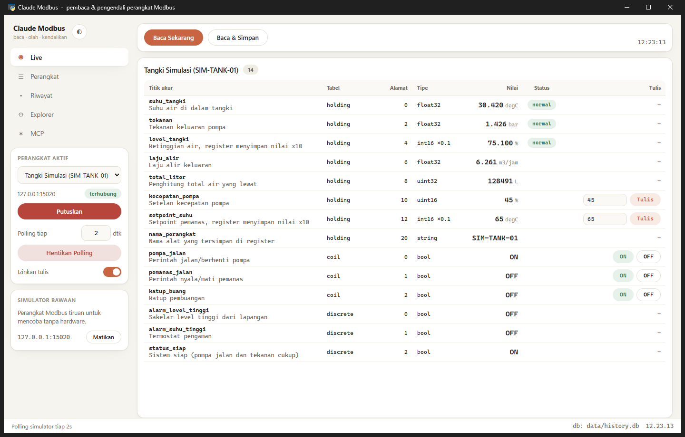
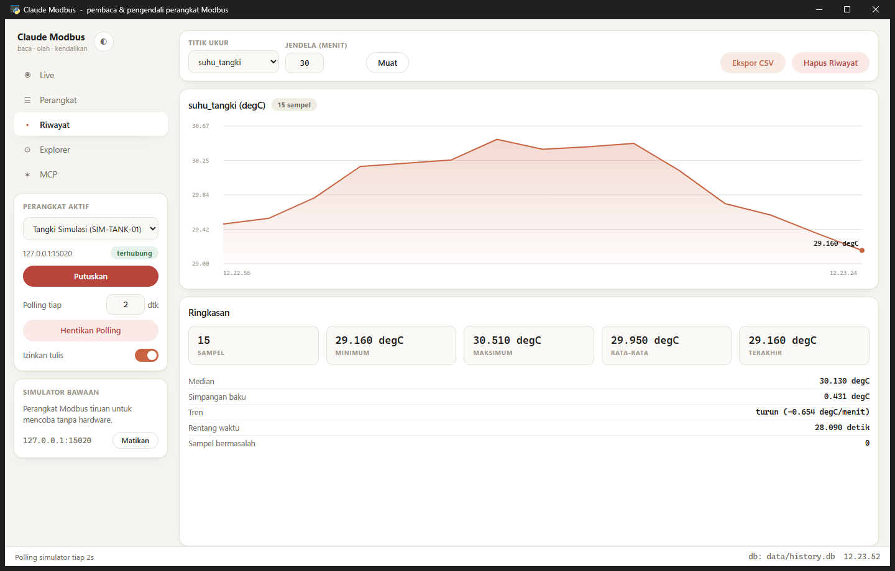

# Claude Modbus

Baca, olah, dan kendalikan perangkat Modbus dari Python — **lengkap dengan GUI
dan MCP server**, supaya Claude bisa ikut membaca datanya dan (kalau diizinkan)
mengendalikannya.

GUI dan MCP server memakai **mesin yang sama**: perangkat yang sama, profil
register yang sama, riwayat yang sama, dan pengaman tulis yang sama.



---

## Jalankan

```bash
pip install -r requirements.txt
python -m gui.app          # GUI  (atau klik JALANKAN.bat)
python -m core.simulator   # simulator perangkat, untuk coba tanpa hardware
```

Belum punya alat Modbus? Klik **Nyalakan** di kotak *Simulator bawaan*, lalu
**Hubungkan**. Simulator adalah tangki air dengan pompa, pemanas, dan flowmeter
yang nilainya bergerak sendiri — cukup untuk mencoba seluruh fitur.

Uji semuanya tanpa hardware:

```bash
python selftest.py         # simulator + mesin + API GUI
python selftest_mcp.py     # MCP server sungguhan lewat stdio
python -m core.models      # validasi model & penskalaan
```

---

## Sambungkan ke Claude (MCP)

Claude Code:

```bash
claude mcp add modbus -- python -m mcp_server.server
```

Claude Desktop — tambahkan ke `claude_desktop_config.json`:

```json
{
  "mcpServers": {
    "modbus": {
      "command": "python",
      "args": ["-m", "mcp_server.server"],
      "cwd": "C:/path/ke/claude-modbus"
    }
  }
}
```

Halaman **MCP** di GUI menampilkan perintah dan JSON yang sudah terisi path
Python dan folder project di komputermu, tinggal salin.

### 22 tool yang tersedia

| Kelompok | Tool |
|---|---|
| Kenali | `modbus_list_devices`, `modbus_describe_device` |
| Koneksi | `modbus_connect`, `modbus_disconnect` |
| Baca | `modbus_read_all`, `modbus_read_point`, `modbus_read_raw` |
| Tulis | `modbus_write_point`, `modbus_write_raw` |
| Rekam | `modbus_start_polling`, `modbus_stop_polling` |
| Olah | `modbus_statistics`, `modbus_history`, `modbus_alarms`, `modbus_recorded_points`, `modbus_export_csv` |
| Petakan | `modbus_add_device`, `modbus_add_point`, `modbus_remove_device` |
| Jelajahi | `modbus_scan_units`, `modbus_scan_registers` |
| Coba-coba | `modbus_simulator` |

Contoh yang bisa kamu minta ke Claude setelah MCP tersambung:

> "Nyalakan simulatornya, hubungkan, lalu laporkan kondisi tangki sekarang."
>
> "Poll suhu tangki tiap 2 detik selama semenit, lalu bilang trennya naik atau turun."
>
> "Saya punya datasheet: holding register 40001 suhu float32, 40003 tekanan
> uint16 dikali 0.1. Buatkan profil perangkatnya."
>
> "Register alat ini tidak terdokumentasi. Sapu holding 0–100 dan tebak mana
> yang kelihatan seperti suhu."

---

## Pengaman tulis (penting)

Menulis ke perangkat Modbus itu **menggerakkan alat sungguhan**. Karena itu
perintah tulis harus lolos tiga lapis:

1. profil perangkat punya `allow_write: true` (saklar **Izinkan tulis** di GUI),
2. titik ukurnya ditandai `writable: true`,
3. server MCP tidak dijalankan dengan `CLAUDE_MODBUS_READONLY=1`.

Kalau salah satu tidak terpenuhi, perintah ditolak dengan alasan yang jelas —
bukan diam-diam gagal. Titik ukur di tabel `input` dan `discrete` tidak akan
pernah bisa ditulis karena standar Modbus memang hanya-baca.

Untuk pemakaian sehari-hari yang aman, jalankan MCP-nya read-only:

```bash
CLAUDE_MODBUS_READONLY=1 python -m mcp_server.server
```

---

## Lima halaman GUI

1. **Live** — semua titik ukur beserta nilai terkini, satuan, dan status alarm.
   Titik ukur yang writable punya kotak isian / tombol ON-OFF langsung di baris.
2. **Perangkat** — daftar perangkat, tambah perangkat baru (TCP atau RTU serial),
   tambah titik ukur (alamat, tipe data, skala, satuan, batas alarm).
3. **Riwayat** — grafik deret waktu + ringkasan: min, max, rata-rata, median,
   simpangan baku, arah tren per menit. Bisa diekspor ke CSV.
4. **Explorer** — baca/tulis register mentah, cari unit id yang menjawab, sapu
   blok register untuk memetakan alat yang dokumentasinya tidak lengkap.
5. **MCP** — status, perintah pemasangan, dan log mesin.



---

## Profil perangkat

Satu perangkat = satu file JSON di `profiles/`. Contohnya ada di
`profiles/simulator.json`. Isi satu titik ukur:

```json
{
  "name": "level_tangki",
  "address": 4,
  "table": "holding",
  "datatype": "int16",
  "scale": 0.1,
  "unit": "%",
  "description": "Ketinggian air, register menyimpan nilai x10",
  "alarm_low": 10.0,
  "alarm_high": 85.0,
  "writable": false
}
```

- `table`: `holding` (FC3/6/16), `input` (FC4), `coil` (FC1/5), `discrete` (FC2)
- `datatype`: `int16`, `uint16`, `int32`, `uint32`, `int64`, `uint64`,
  `float32`, `float64`, `string` — coil/discrete otomatis jadi `bool`
- `word_order`: `big` (default) atau `little` kalau alatmu membalik urutan word
- nilai akhir = `register × scale + offset`

Alamat memakai **basis 0**. Kalau datasheet menulis `40001`, itu biasanya
holding register alamat `0`.

---

## Struktur

```
core/
  models.py      Point & Device: validasi, penskalaan, evaluasi alarm
  engine.py      koneksi, baca/tulis, polling, scan, pengaman tulis
  history.py     SQLite + statistik (min/max/rata2/median/stdev/tren)
  profiles.py    muat & simpan profil JSON
  simulator.py   perangkat Modbus TCP tiruan untuk uji coba
mcp_server/
  server.py      modbus_mcp - 22 tool untuk Claude (stdio)
gui/
  app.py         jendela pywebview + API yang dipanggil dari JS
  web/           index.html, style.css, app.js
profiles/        profil perangkat (JSON)
data/            history.db + preferensi GUI (dibuat otomatis)
```

Dibangun di atas [pymodbus](https://github.com/pymodbus-dev/pymodbus) 3.12 dan
[MCP Python SDK](https://github.com/modelcontextprotocol/python-sdk).

---

## Status pengujian

Semua diuji lewat simulator bawaan: pembacaan 14 titik ukur dengan berbagai
tipe data, penulisan berskala dengan baca-balik, ketiga lapis pengaman tulis,
polling + statistik, alarm, ekspor CSV, pembuatan profil dari nol, scan, dan
seluruh 22 tool MCP lewat protokol stdio sungguhan.

**Belum diuji dengan PLC/perangkat Modbus fisik.** Untuk pemakaian pertama di
alat sungguhan, mulailah read-only: biarkan `allow_write` mati, baca dulu,
cocokkan nilainya dengan display alat, baru pertimbangkan menulis.
